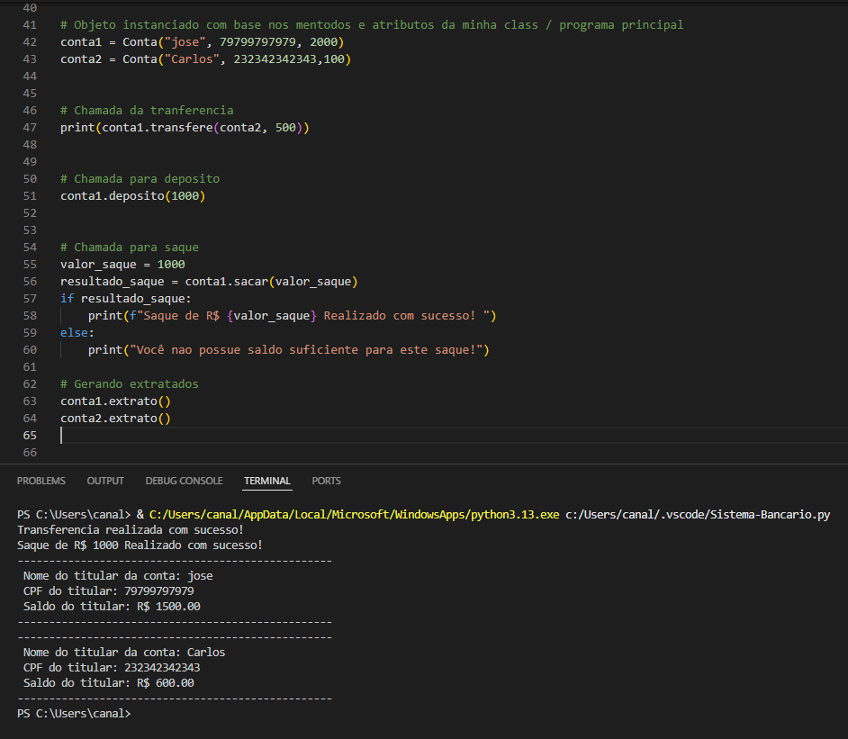

🏦 Sistema Bancário Simples (POO com Python)
Este repositório contém um exemplo prático de implementação de Programação Orientada a Objetos (POO) em Python. O projeto simula o funcionamento básico de uma conta bancária, permitindo operações como depósito, saque, transferência e consulta de extrato.

🚀 Funcionalidades
O sistema foi estruturado em torno da classe Conta, que gerencia as seguintes operações:

Depósito: Adiciona valores ao saldo da conta.

Saque: Deduz valores do saldo, com verificação de segurança para impedir saques maiores que o saldo disponível.

Transferência: Permite enviar valores entre diferentes instâncias (objetos) de contas, validando o saldo antes da operação.

Extrato: Exibe de forma organizada os dados do titular (Nome, CPF) e o saldo atualizado.

🛠️ Conceitos de POO Aplicados
Para quem está estudando Python, este código demonstra:

Classes e Objetos: Criação do molde Conta e instanciação de usuários reais (conta1, conta2).

Métodos (self): Funções internas que manipulam os dados do próprio objeto.

Atributos: Armazenamento de estado (nome, CPF, saldo) de forma encapsulada.

💻 Como executar
Certifique-se de ter o Python 3.x instalado.

Clone o repositório ou copie o código para um arquivo .py.

Execute o script:
